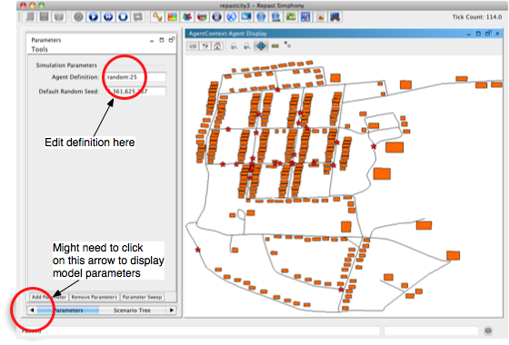

Extending RepastCity
====================

This page provides instructions describing how the model can be extended to suit individual applications.

Using New Input Data
====================

The most obvious requirement will to replace the demo data included with the model with something more realistic. The model reads spatial data in [shapefile](http://en.wikipedia.org/wiki/Shapefile) format which is a proprietary format used by ESRI ArcGIS. There are many (open source) programs that can be used to read or edit shapefile data (see [QuantumGIS](http://www.qgis.org/_)  for example) if ArcGIS is not available.


The virtual **city** consists of ***roads*** and ***buildings*** (note that in later versions  *communities* will also be used). For the default model, all the shapefile data are stored in the `data/gis_data/toy_city` directory. This directory can be changed by editing the `repastcity.properties` file and editing the line:

	GISDataDirectory=./data/gis_data/toy_city/

The text `./data/gis_data/toy_city/` can be replaced with the root directory of other GIS data. The model will expect to be able to read the files `roads.shp` and `buildings.shp`. Note that a shapefile is actually a collection of files so if other GIS data are used it is important to copy all files to the new directory, not just the `.shp` files.

Requirements for road data
--------------------------

There are some specific requirements for road data. Firstly, there cannot be any ***disconnected roads*** (the entire network must be joined together). Also, the model requires that if two roads cross then the line objects break at the point that they cross (the intersection). If this requirement is not met then the model will probably not crash, but routing will not work properly. The `Planarize Lines`_ function in ArcGIS is able to convert data to this form.

[Planarize Lines](http://help.arcgis.com/en/arcgisdesktop/10.0/help/index.html#//001t0000008t000000.htm)

Agent Home Locations
====================

The starting locations of the agents can be changed in a similar manner to the other spatial data. The model searches the GIS data directory (`data/gis_data/toy_city` by default) for a shapefile of points called `people.shp`. It then reads that shapefile and creates an agent at each point. If the agent falls within a building it will set that building to be the agent's home. Therefore, `people.shp` can be replaced with another file to change the starting locations (and number of) agents.

It is also possible to create a number of agents in randomly chosen buildings rather than reading their locations from a file. To do this, follow these steps:

1. Start the model.

    * In the bottom-right corner of the model window click on the left arrow (next to `Scenario Tree`). This should change the left frame to show model parameters.

2. In the `Agent Definition`, replace the text `point:people.shp$repastcity3.agent.DefaultAgent` with:

    `random:N` (where N is the number of agents to create, e.g. `random:25`).
3. Press the 'save' icon to remember the change (optional).
4. Run the model.



For more information about the different ways to create agents, see the Java documentation for the `repastcity3.agent.AgentFactory` class.

Agent Behaviour
===============

Method 1 - Edit `step()`
--------------------------

By default, RepastCity creates agents of the type  `repastcity3.agent.DefaultAgent`. The `DefaultAgent.java` source file contains a method called `step()`; this is the one that is called at each iteration and controls how the agents behave. Hence the simplest way to change agent behaviour is to change the code in this method.

By default, each agent chooses a building at random, travels there, and then travels home again. The following code illustrates how this can be accomplished.
```java
	@Override
	public void step() throws Exception {
		// See if the agent has a route object (this controls their movement).
		if (this.route == null) { // No route object, create one.
			this.goingHome = false;
			// Choose a new building to travel to
			Building b = ContextManager.buildingContext.getRandomObject();
			this.route = new Route(this, b.getCoords(), b);
		}
		
		// See if the agent has reached their destination or if they need to keep travelling
		if (!this.route.atDestination()) { 
			this.route.travel();
		} 
		else {
			// Have reached destination, now either go home or onto another building
			if (this.goingHome) {
				this.goingHome = false;
				Building b = ContextManager.buildingContext.getRandomObject();
				this.route = new Route(this, b.getCoords(), b);
			} else {
				this.goingHome = true;
				this.route = new Route(this, this.home.getCoords(), this.home);
			}
		}
	} // step()
```
Method 2 - Implement `IAgent`
-------------------------------

Alternatively, it is possible to provide a completely new agent type (or many different types in the same model). This can be achieved by creating a new class that implements the `IAgent` interface. Then, to tell the model to use this new type, rather than `DefaultAgent`, follow these steps:

1. Start the model.
2. In the bottom-right corner of the model window click on the left arrow (next to `Scenario Tree`). This should change the left frame to show model parameters.
3. In the `Agent Definition`, replace the text `point:people.shp$repastcity3.agent.DefaultAgent` with the name of the new class. For example, if the class were called `MyAgent` and belonged to the package `repastcity3.new_agents` the entry would be:
    `point:people.shp$repastcity3.new_agents.MyAgent`
4. Press the 'save' icon to remember the change (optional).
5. Run the model.

Note that if a new agent type is used this new agent type must be ***added to the display*** or it will not be shown when the model is running. The existing display only shows objects of type `DefaultAgent`.

