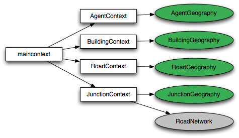

RepastCity - Model Structure
============================

Contexts and Projections
========================

In Repast Simphony models, agents are organised into collections called **Contexts**. A context is basically a bucket that can be used to hold agents. Contexts are arranged hierarchically and can contain sub-contexts. Agents who exist in a sub-context also exist in the parent context, but the reverse is not necessarily true. For example, in a *School* context there might be *Teacher* and *Student* sub-contexts (and even further *Class* sub-contexts).

**Projections** are used to give the agents a space and can define their relationships. For example, 'GIS' projections gives each agent an (x, y) spatial location and 'Network' projections allow relationships between agents to be defined (e.g. a social network). Projections are created for specific contexts and will automatically contain every agent within the context (so if an agent is added to a context it is also added to any projections which have been created on that context).

The figure below illustrates the organisation of the RepastCity model. Each context has an associated GIS projection to store the spatial locations of the objects. 

The *JunctionContext* is at the central means of routing agents. A Junction object is defined as the point at which two roads cross (e.g. an intersection). Therefore the *JunctionGeogaraphy* GIS projection is used to hold all the road intersections, and *RoadNetwork* is a network projection that contains the links between different junctions. Hence agents use the network to work out how to move from one place to another along the road network.

A fuller description of the routing algorithm itself is available on the [crimesim blog]( http://crimesim.blogspot.com/2008/05/using-repast-to-move-agents-along-road.html)

Source Code
===========

Packages
--------

The source code is organised into the following packages:

* `repastcity3.agent` contains classes describe the agents.
* `repastcity3.environment` contains classes that define and interact with the environment (including reading input data, defining environment objects and generating routes).
* `repastcity3.main` contains classes control model execution, including model initialisation and method scheduling.
* `repastcity3.exceptions` contains all model-specific exception classes.

Important Classes
-----------------

The following classes are the most important ones to be aware of in order to extend the functionality of the model.

`repastcity3.agent.DefaultAgent`

This is a simple example of an agent that implements the `IAgent` interface. The most important is `step()` which is called by the Repast scheduler once per model iteration. Therefore the easiest way to change how the agents behave is to edit the code in the `step()` method.

`repastcity3.main.ContextManager`

The `ContextManager` class is used to initialise the model. It is responsible for reading the input GIS files, creating contexts/projections, generating agents and initialising the schedule. It also keeps references to all the model contexts and projections for convenience.

`repastcity3.environment.Route`

The `Route` class contains the code to generate a route from one place to another along the road network. It works by creating a list of coordinates that an agent must traverse to get to their destination. `Route` is responsible for actually moving the agents - e.g. an agent calls `route.travel()` to move. A fuller description of the routing algorithm itself is available on the [crimesim blog]( http://crimesim.blogspot.com/2008/05/using-repast-to-move-agents-along-road.html)
